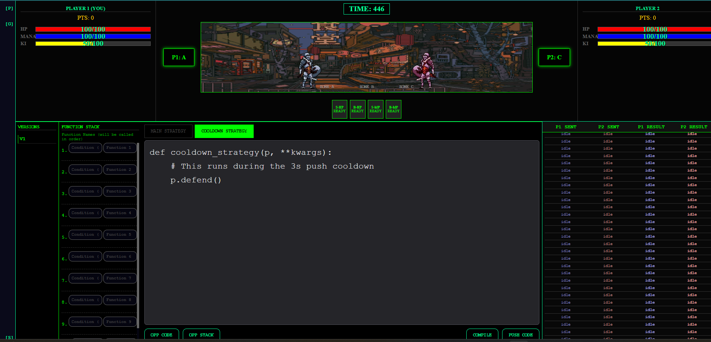

# CodePixel Arena

> **A strategic multiplayer coding game where you battle opponents by writing Python code.**

CodePixel Arena combines competitive gaming with programming challenges. Write intelligent Python strategies, watch real-time battles unfold, and climb the ranks. Perfect for developers who love both coding and gaming.



## 📋 Table of Contents

- [Features](#features)
- [Game Overview](#game-overview)
- [Technology Stack](#technology-stack)
- [Getting Started](#getting-started)
- [How to Play](#how-to-play)
- [Game Mechanics](#game-mechanics)
- [API Reference](#api-reference)
- [Development](#development)
- [Troubleshooting](#troubleshooting)
- [Contributing](#contributing)
- [License](#license)

## ✨ Features

- **Real-Time Multiplayer Battles**: Watch your code execute against opponents in real-time
- **Python-Based Strategy System**: Define custom battle strategies using Python
- **Rich Game Mechanics**: Multiple attack types, resource management, and tactical positioning
- **User Accounts & Rankings**: Track stats, build a friend list, and compete on global leaderboards
- **Public & Private Rooms**: Play casually with friends or test your skills against random opponents
- **Live Visualization**: Dynamic battle animations showing health, positioning, and resource usage
- **Secure Code Execution**: User Python code runs in sandboxed environments

## 🎮 Game Overview

### Arena Layout

The game takes place on a **1D grid with 6 zones** (Positions 0-5), divided into 3 regions:

- **Zone A** (Positions 0-1): Player 1's starting area
- **Zone B** (Positions 2-3): Neutral territory
- **Zone C** (Positions 4-5): Player 2's starting area

**Initial Setup:**
- Player 1 spawns at Position 0 (Left)
- Player 2 spawns at Position 5 (Right)

### Core Game Mechanics

#### Turn System
- **Hybrid Model**: Submit your strategy once at the start, then the game executes actions each turn in real-time
- **Tick-Based Execution**: Each turn represents a game tick where your Python code determines the next action

#### Resources

| Resource | Purpose | Regeneration |
|----------|---------|--------------|
| **HP** | Health points. Reach 0 to lose | None (use items to heal) |
| **Mana** | Powers ranged and special attacks | Slowly over time |
| **Ki** | Energy for movement and special abilities | Every 10 actions |

#### Available Actions

| Action | Cost | Effect | Description |
|--------|------|--------|-------------|
| `attack1` | Low | Moderate damage | Basic melee attack |
| `attack2` | Mana | High damage | Ranged attack (costs mana) |
| `attack3` | Ki | High damage | Special attack (costs ki) |
| `run` | Ki | Move forward 1 zone | Advance toward opponent |
| `runopp` | Ki | Move backward 1 zone | Retreat away from opponent |
| `runattack` | High Ki | Move + attack | Aggressive move (high cost) |
| `push` | Low | Push opponent back | Only works in same zone |
| `defend` | None | Reduce damage taken | Defensive stance (passive resource regen) |
| `idle` | None | No effect | Do nothing (for recovery) |

#### Items & Cards

Each player has **consumable cards** (single-use items):
- **HP Potions**: Restore health
- **Mana Potions**: Restore mana
- Use them strategically within battle

### Example Strategy

```python
# Aggressive rush strategy
if p.hp > 50:
    if p.position < 5:
        p.run()  # Move toward opponent
    else:
        p.attack1()  # Attack if in range
elif p.hp < 20:
    p.use_card_big_hp()  # Use HP potion to survive
else:
    p.defend()  # Play defensively
```

## 🛠️ Technology Stack

### Frontend
- **React 18**: Modern UI components and state management
- **Vite**: Lightning-fast build tool
- **Socket.IO Client**: Real-time websocket communication

### Backend
- **Node.js & Express**: RESTful API server
- **Socket.IO**: Real-time game state synchronization
- **Python Bridge**: Secure execution of user Python code via `python-shell`

### Database
- **SQLite**: Persistent storage for users, profiles, friends, and rankings

### DevOps & Deployment
- **Docker**: Multi-stage containerized build for both frontend and backend
- **Node 18**: Lightweight base image with Python 3 support

## 🚀 Getting Started

### Prerequisites

- **Docker** (Recommended) - Download from [docker.com](https://www.docker.com/products/docker-desktop)
- **Git** - For cloning the repository
- **Node.js 18+** & **npm** (Only for manual setup)
- **Python 3.8+** (Only for manual setup)

### Quick Start (Docker - Recommended)

**1. Clone the repository:**
```bash
git clone https://github.com/yashwanthchikki/game.git
cd game
```

**2. Build the Docker image:**
```bash
docker build -t codepixel-arena .
```

**3. Run the container:**
```bash
docker run -p 5001:5001 codepixel-arena
```

**4. Open your browser:**
Navigate to `http://localhost:5001` and start playing!

### Manual Setup (Development)

If you prefer running the application without Docker:

**Frontend Setup:**
```bash
cd frontend
npm install
npm run dev
```
Frontend runs on `http://localhost:5173` (Vite dev server)

**Backend Setup (in a new terminal):**
```bash
cd backend
npm install
npm run start        # For production
# OR
npm run dev          # For development with hot-reload
```
Backend API runs on `http://localhost:5001`

> **Note**: The backend requires Python 3 to be installed on your system.

## 📝 How to Play

### Step 1: Register / Login
Create your account to track personal stats and unlock ranked features.

### Step 2: Create or Join a Room
- **Public Room**: Play against random opponents
- **Private Room**: Host a game and share the Room ID/Password with friends

### Step 3: Write Your Strategy
Use the in-game Python IDE to program your character's behavior:

```python
class BattleStrategy:
    def decide_action(self, player_state, opponent_state):
        # Your logic here
        if player_state.hp < 30:
            return player_state.use_card_big_hp()
        elif player_state.position < opponent_state.position:
            return player_state.run()
        else:
            return player_state.attack1()
```

### Step 4: Push Code to Server
Click "Submit" to send your strategy to the game server.

### Step 5: Watch & Learn
The battle executes in real-time. Watch the visualization, learn from the result, and iterate!

## 🎯 Game Mechanics

### Position & Movement
- Players move across the 1D grid
- Movement costs Ki energy
- Different attack types have different range requirements

### Combat System
- **Damage Calculation**: Depends on distance, attack type, and defender's stance
- **Defense**: Reduces incoming damage but prevents attacking
- **Combos**: Chain multiple actions for strategic advantage

### Resource Management
- **Mana Management**: Plan ranged attacks carefully
- **Ki Efficiency**: Balance movement with action costs
- **Health Management**: Know when to heal vs. attack

### Win Condition
- Reduce opponent's HP to 0
- Opponent disconnects or timeout

## 🔌 API Reference

### HTTP REST Endpoints

Used for user management and profile operations:

| Endpoint | Method | Purpose |
|----------|--------|---------|
| `/health` | GET | Server health check |
| `/api/register` | POST | User registration |
| `/api/login` | POST | User authentication |
| `/api/auth/change-password` | POST | Change account password |
| `/api/profile/update` | POST | Update user profile info |
| `/api/profile/get` | GET | Retrieve own profile |
| `/api/profile/user/:username` | GET | Get another user's public profile |
| `/api/users/search` | GET | Search for users by username |
| `/api/rankings` | GET | Get global leaderboard (paginated) |
| `/api/friends/connect` | POST | Send friend request |
| `/api/friends/accept` | POST | Accept friend request |
| `/api/friends/disconnect` | POST | Remove friend |
| `/api/friends/list` | POST | Get friend list |

### WebSocket Events

Used for **real-time multiplayer battles** and gameplay:

**Lobby & Room Management:**
- `create_room`: Host a new game room (public or private)
- `room_created`: Server confirms room creation with ID & password
- `get_public_rooms`: Fetch list of available public rooms
- `public_rooms_list`: Receive public rooms list
- `join_room`: Join an existing game room
- `join_success`: Server confirms successful room join
- `user_joined`: Opponent joined the room

**Battle & Gameplay:**
- `push_code`: Submit Python strategy code to the server
- `code_pushed`: Server confirms code submission
- `compile_code`: Check Python syntax before submission
- `get_opponent_data`: Fetch opponent's current stats/position
- `opponent_data`: Receive opponent state data
- `game_state_update`: Real-time battle state changes (HP, position, resources)
- `player_action`: Result of your action execution
- `opponent_action`: Result of opponent's action
- `match_end`: Battle concluded with winner information

**Example WebSocket Usage:**
```javascript
// Connect and join a room
socket.emit('create_room', { isPublic: true });
socket.on('room_created', ({ roomId, password }) => {
    console.log('Room created:', roomId);
});

// Push strategy code during battle
socket.emit('push_code', {
    code: 'if p.hp < 30: p.use_card_big_hp()',
    roomId: roomId
});

// Listen for real-time game updates
socket.on('game_state_update', (state) => {
    console.log('New state:', state);
});
```

## 🛠️ Development

### Project Structure

```
game/
├── frontend/              # React application
│   ├── src/
│   ├── public/
│   └── package.json
├── backend/               # Node.js server
│   ├── game_engine/       # Core game logic
│   ├── config/            # Configuration files
│   ├── utils/             # Helper functions
│   ├── server.js          # Express server entry point
│   └── package.json
├── Dockerfile             # Multi-stage build
└── README.md
```

### Running Tests

```bash
# Backend tests (if available)
cd backend
npm test

# Frontend tests (if available)
cd frontend
npm test
```

### Development Workflow

1. Make changes in `frontend/` or `backend/`
2. Frontend dev server auto-reloads on `http://localhost:5173`
3. Backend requires manual restart (or use `npm run dev` with nodemon)
4. Test your changes locally before pushing

## 🐛 Troubleshooting

### Port 5001 Already in Use
```bash
# Find and kill the process using port 5001
lsof -i :5001
kill -9 <PID>

# Or use a different port
docker run -p 5002:5001 codepixel-arena
```

### Python Not Found
Ensure Python 3.8+ is installed and in your system PATH:
```bash
python --version
python3 --version
```

### WebSocket Connection Failures
- Check that the backend is running on port 5001
- Verify CORS settings in `backend/server.js`
- Check browser console for specific error messages

### Code Execution Errors
- Review the error message in the game UI
- Check Python syntax: use proper indentation and function calls
- Common issue: calling undefined methods on player object

### Docker Build Fails
- Ensure Docker daemon is running
- Clear Docker cache: `docker system prune`
- Rebuild: `docker build --no-cache -t codepixel-arena .`

## 🤝 Contributing

We welcome contributions! Here's how to get involved:

### Reporting Issues
- Use GitHub Issues to report bugs
- Provide clear description, steps to reproduce, and expected behavior
- Include screenshots or error logs if applicable

### Proposing Features
- Open a discussion or issue before starting development
- Describe the feature and its benefits
- Gather feedback from maintainers

### Pull Request Process
1. Fork the repository
2. Create a feature branch: `git checkout -b feature/amazing-feature`
3. Make your changes following code conventions
4. Test thoroughly (frontend, backend, Docker)
5. Commit with clear messages: `git commit -m 'Add amazing feature'`
6. Push to your fork: `git push origin feature/amazing-feature`
7. Open a Pull Request with a detailed description

### Code Style Guidelines
- **JavaScript**: Use consistent indentation (2 spaces), follow existing patterns
- **Python**: Follow PEP 8 conventions
- **React**: Use functional components and hooks

## 📄 License

This project is licensed under the MIT License - see the [LICENSE](https://choosealicense.com/licenses/mit/) file for details.

---

**Happy coding and may the best strategy win! 🎮⚔️**
